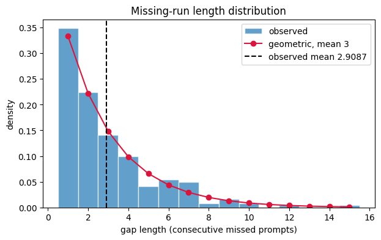
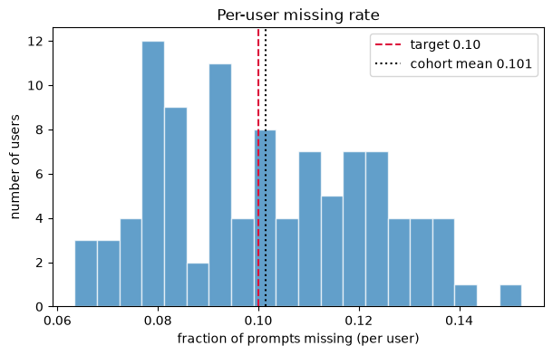
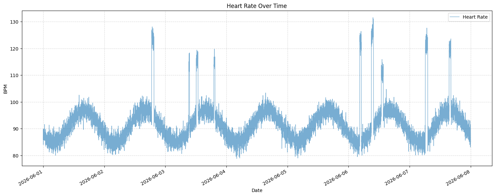
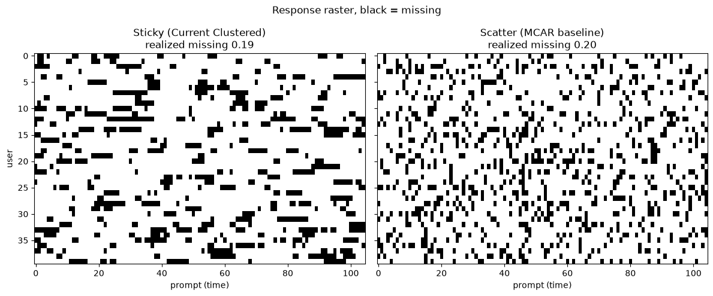

# syntheticData

*Tyler Le*

*Date: 06/02/2026*

[GITHUB](<https://github.com/tylerrleee/HealthyGatorSportFan/tree/mssd-tyler>)

Synthetic data generation for EMA (Ecological Momentary Assessment) and heart rate (HR) signals, used to validate MSSD (Mean of Squared Successive Differences) as a measure of temporal instability.

# Scope

We are focusing on qualitative (EMA) and quantitative simulation (HR), so other quantitative values (steps, sleep, etc,..) are omitted for the purpose of simulation concept review and simplicity of debugging.

## Files

### `main.py`

Generates a cohort of 100 synthetic users over 7 days, producing both EMA and heart rate DataFrames (DF). Runs all diagnostic plots and saves them to `figures/`.

In scope: Parameters can be tweaked to simulate different cohorts, producing a distinct DF. 

Out of scope: DF does not save. 

### `synthetic_generator.py`

Core data generation module. Contains two generators:

- **EMA Generator** — Produces per-user EMA time series with known latent volatility using an AR(1) process (see below about why AR(1)). 
    - Each user gets randomly drawn parameters (`mu`, `sigma`, `rho`) that serve as ground truth for validating MSSD. EMA values are mapped to a 1-5 Likert scale (for now). Missingness or no response is injected via randomness (`_clustered_missing_mask`) that produces realistic clustered gaps rather than random dropout.
    - No response are clustered, instead of purely random. Although this missingness can be controlled, it helps simualate the prolonged responsiveness of certain individuals
        - e.g. phone is on DND, has an exam, watching the Knicks winning NBA Finals, etc,..
    
  - `generate_user_ids()` - Creates unique UUIDs for each user.
  - `generate_user()` - Generates one user's EMA series with known latent parameters.
  - `generate_cohort()` - Generates the full cohort DataFrame.

- **Heart Rate Generator** — Produces minute-level HR data per user, random Gaussian noise, and activity bouts (exercise spikes). Resting HR is estimated from [60,100] for young adults. 
  - `_generate_heart_rate()` — Generates one user's minute-level HR series.
  - `generate_HR()` — Generates HR data for the full cohort.
    - Parameters are tweakable in `synthetic_generator.py`

#### First-Order Autoregressive Model

*['Autoregressions', Economics-With-R](<https://www.econometrics-with-r.org/14.3-autoregressions.html>)*

An autoregressive model relates a time series variable to its past values.

In our case, the goal is to 'model' a person's fluctuating psychological state, which is **dependent on the previous state**.

Formula:

$$
z_t = \rho * z_{t-1} + e_t
$$

$z_t$: User's state

$z_{t-1}$: User's state at the previous time step

$e_t$ : Random noise that influence user's state (e.g. FSU just scored, just took some cognac, hitting a PR)

e_t ~ $Normal(0, \sigma_{e^2})$ : random noise is Normally distributed.
  - On average, most noise are close to the mean, 0, but sometimes, depending $\sigma_{e^2}$, it can be influential

### `plotting.py`

Diagnostic visualizations for validating the synthetic data. All figures are saved to `figures/`.

- `plot_gap_histogram()` — Distribution of missing-run lengths vs. the expected geometric distribution.
- `plot_missing_rate_histogram()` — Per-user missing rate distribution compared to the target response rate.
- `plot_response_raster()` — Side-by-side raster comparing clustered (sticky) missingness against an MCAR baseline.
- `plot_heart_rate()` — Heart rate over time for a single user.

### `notebook/Tien_Le_MSSD_v1_0.ipynb`

Research notebook documenting the MSSD methodology

### `figures/`

Output directory for saved plots:

- `gap_histogram.png` - Missing-run length distribution.

- `missing_rate_histogram.png` - Per-user missing rate histogram.

- `heart_rate_analysis.png` - Sample heart rate time series.

- `response_raster.png` - Sticky vs. scatter missingness raster.

